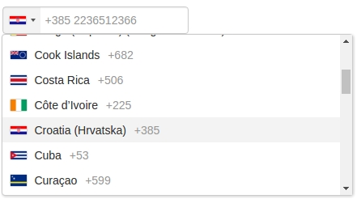

# International Telephone Input for Angular (NgxIntlTelInput)

[](https://travis-ci.org/webcat12345/ngx-intl-tel-input) [](https://badge.fury.io/js/ngx-intl-tel-input) [](https://www.npmjs.com/package/ngx-intl-tel-input)

An Angular package for entering and validating international telephone numbers. It adds a flag dropdown to any input, detects the user's country, displays a relevant placeholder and provides formatting/validation methods.



**Supports:**

- Angular 7
- ReactiveFormsModule
- FormsModule
- Validation with [google-libphonenumber](https://github.com/ruimarinho/google-libphonenumber)

## Installation

### Install Dependencies

```$ npm install intl-tel-input --save```

```$ npm install google-libphonenumber --save```

```$ ng add ngx-bootstrap```

### Add Dependency Style

Add *'intl-tel-input'* style file: 

```./node_modules/intl-tel-input/build/css/intlTelInput.css```

to **angular.json** styles array:

```json

"styles": [
  "./node_modules/bootstrap/dist/css/bootstrap.min.css",
  "./node_modules/ngx-bootstrap/datepicker/bs-datepicker.css",
  "./node_modules/intl-tel-input/build/css/intlTelInput.css",
  "src/styles.css"
],

```

### Install This Library

```$ npm install ngx-intl-tel-input --save```

## Usage

### Import

Add ```BsDropDownModule``` and ```NgxIntlTelInputModule``` to your module file:

```javascript

imports: [
    BsDropdownModule.forRoot(),
    NgxIntlTelInputModule,
  ]

```

## Example

Refer to main app in this repository for working example.

Or this Stackblitz url (TODO: add URL).

```html

<form #f="ngForm" [formGroup]="phoneForm">
  <ngx-intl-tel-input
  [cssClass]="'custom'"
  [preferredCountries]="['us', 'gb']"
  [enablePlaceholder]="true"
  name="phone"
  formControlName="phone"></ngx-intl-tel-input>
</form>

```

## Options

| Options            | Type                   | Default            | Description                                                   |
| -------------------|------------------------|--------------------|---------------------------------------------------------------|
| cssClass           | ```string```           | ```control-form``` | Bootstrap input css class or your own custom one.             |
| preferredCountries | ```string[]```         | ```[]```           | List of country abbreviations, which will appear at the top.  |
| enablePlaceholder  | ```boolean```          | ```true```         | Input placeholder text, which addapts to the country selected.|

## Library Contributions

- Fork repo.
- Update ```./projects/ngx-intl-tel-input```
- Build / test library.
- Update ```./src/app``` with new functionality.
- Update README.md
- Pull request.

### Helpful commands

- Build lib: ```$ npm run build_lib```
- Copy license and readme files: ```$ npm run copy-files```
- Create package: ```$ npm run npm_pack```
- Build lib and create package: ```$ npm run package```

### Use localy

After building and creating package, you can use it localy too.

In your project run:

```$ npm install --save {{path to your local '*.tgz' package file}}```
